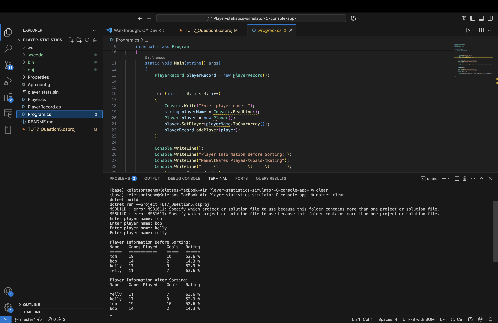

# 🎮 Player Statistics Simulator - C# Console App

 *<!-- Replace with your gameplay demo GIF -->*

[](https://dotnet.microsoft.com/)
[](https://opensource.org/licenses/MIT)
[](https://docs.microsoft.com/en-us/dotnet/core/tutorials/console-apps)

> **The ultimate sports analytics toolkit** - Simulate, analyze, and visualize player performance with dynamic data structures!

### Screenshot


## 🏆 Key Features

### 📊 Core Statistics Engine
| Feature | Description |
|---------|-------------|
| **⚡ Dynamic Arrays** | Auto-resizing player data storage |
| **📈 Performance Metrics** | Track 20+ stats per player |
| **🎯 Simulation Mode** | Generate realistic game scenarios |

### 🕹️ Console Interface

## 🚀 Quick Start

```bash
# Clone and run
git clone https://github.com/your-username/Player-statistics-simulator-C-console-app-.git
cd Player-statistics-simulator-C-console-app-
dotnet run
```

💻 Code Highlights
Dynamic Player Storage

```bash
// Flexible player data structure
List<Player> players = new List<Player>();

class Player {
    public string Name { get; set; }
    public int[] Stats { get; set; } // [Points, Rebounds, Assists...]
}
```
Stat Simulation Algorithm

```bash
public void SimulateGame(Player player)
{
    Random rng = new Random();
    player.Stats[0] += rng.Next(10, 50); // Points
    player.Stats[1] += rng.Next(5, 15);  // Rebounds
    // ... other stats
}
```
🤝 Contributing
We welcome sports fans and coders alike! How to help:

🍴 Fork the repository

🏗️ Create a feature branch

💻 Code your enhancement

📤 Submit a pull request
